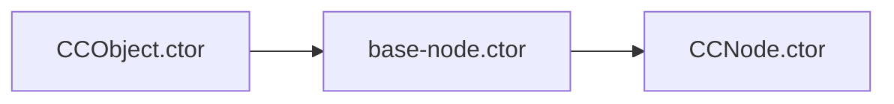

# Base Node

## 前言
_本文基于 Cocos Creator 2.4.8 撰写_

## 正文
A base node for CCNode, it will:
- maintain scene hierarchy and active logic
- notifications if some properties changed
- define some interfaces shares between CCNode
- define machanisms for Enity Component Systems
- define prefab and serialize functions
CCNode 的基础节点，它将：
- 维护场景层次和活动逻辑
- 如果某些属性发生更改，则通知
- 定义CCNode之间的一些接口共享
- 定义实体组件系统的机制
- 定义预制和序列化功能

## SERIALIZABLE
- `_parent`: 父节点
- `_children`: 子节点
- `_active`: 是否激活
- `_components`: 组件
- `_prefab`: 预制体
- `_persistNode`: 是否持久化节点

## properties
- name: 节点名称
- uuid: 主要用于编辑器的 uuid，在编辑器下可用于持久化存储，在项目构建之后生成的对象将变成自增的 id。
- children
- childrenCount
- active: 当前节点的自身激活状态。值得注意的是，一个节点的父节点如果不被激活，那么即使它自身设为激活，它仍然无法激活。当该值变更时会触发`cc.director._nodeActivator.activateNode(this, value)`
- activeInHierarchy: 表示此节点是否在场景中激活。
- _objFlags: 节点标识,`CCObject.Flags`

## Function
### `ctor`
`_name`/`_activeInHierarchy`/`_id`初始化赋值
```
ctor (name) {
    this._name = name !== undefined ? name : 'New Node';
    this._activeInHierarchy = false;
    // 非编辑器下,为自增ID
    this._id = CC_EDITOR ? Editor.Utils.UuidUtils.uuid() : idGenerater.getNewId();
    // 如果_id赋值失败,赋值_id
    cc.director._scheduler && cc.director._scheduler.enableForTarget(this);

    /**
        * Register all related EventTargets,
        * all event callbacks will be removed in _onPreDestroy
        * @property __eventTargets
        * @type {EventTarget[]}
        * @private
        */
    this.__eventTargets = [];
},
```
新生成节点时触发流程图:


### `setParent`
设置父节点,派发相关事件,`_renderFlag`添加相关渲染流
```
setParent (value) {
    ...
    var oldParent = this._parent;
    ...
    this._parent = value || null;
    ...
    if (value) {
        ...
        value._children.push(this);
        value.emit && value.emit(CHILD_ADDED, this);
        value._renderFlag |= RenderFlow.FLAG_CHILDREN;
    }
    if (oldParent) {
        if (!(oldParent._objFlags & Destroying)) {
            var removeAt = oldParent._children.indexOf(this);
            if (CC_DEV && removeAt < 0) {
                return cc.errorID(1633);
            }
            oldParent._children.splice(removeAt, 1);
            oldParent.emit && oldParent.emit(CHILD_REMOVED, this);
            this._onHierarchyChanged(oldParent);

            if (oldParent._children.length === 0) {
                oldParent._renderFlag &= ~RenderFlow.FLAG_CHILDREN;
            }
        }
    }
    else if (value) {
        this._onHierarchyChanged(null);
    }
},
```
## siblingIndex/zIndex
[文档](./siblingIndex_and_zIndex.md)

## remove/Destroy
[文档](./remove_and_destroy.md)

## Activator/Component
