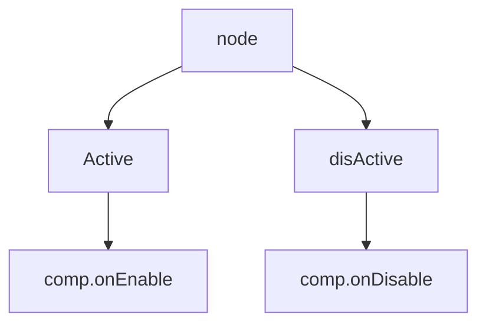

# CCComponent

## 前言
_本文基于 Cocos Creator 2.4.8 撰写_

## 正文
在`CocosCreator`中`Component`代表`Node`的属性/功能.</br>
`Component`有一套生命周期方法,由`component-scheduler`和`node-activator`调用.</br>
当有个`Component`继承了`cc.RenderComponent`,代表了这组件有了渲染功能.

## properties
- node
- name: 如果没有被主动设值,则会通过`cc.js.getClassName`进行组合返回
- uuid: 组件的 uuid，用于编辑器。
- enabled: 表示该组件自身是否启用。赋值时通过`component-scheduler`进行`enableComp`/`disableComp`
- enabledInHierarchy: 表示该组件是否被启用并且所在的节点也处于激活状态。
- executionOrder: 影响组件的生命周期回调的执行优先级。
## 生命周期
- onLoad: 当附加到一个激活的节点上或者其节点第一次激活时候调用。onLoad 总是会在任何 start 方法调用前执行，这能用于安排脚本的初始化顺序。
- start: 如果该组件第一次启用，则在所有组件的 update 之前调用。通常用于需要在所有组件的 onLoad 初始化完毕后执行的逻辑。
- onEnable: 当该组件被启用，并且它的节点也激活时
- onDisable: 当该组件被禁用或节点变为无效时调用。
- onDestroy: 当该组件被销毁时调用

## 流程图
```mermaid
graph TD;
    addChild-->comp.onLoad-->comp.onEnable-->comp.start
    removeChild-->comp.onDisable
    addComponent-->comp.onLoad
    removeComponent--OnlyDisable-->comp.onDisable.->comp.onDestroy
```


