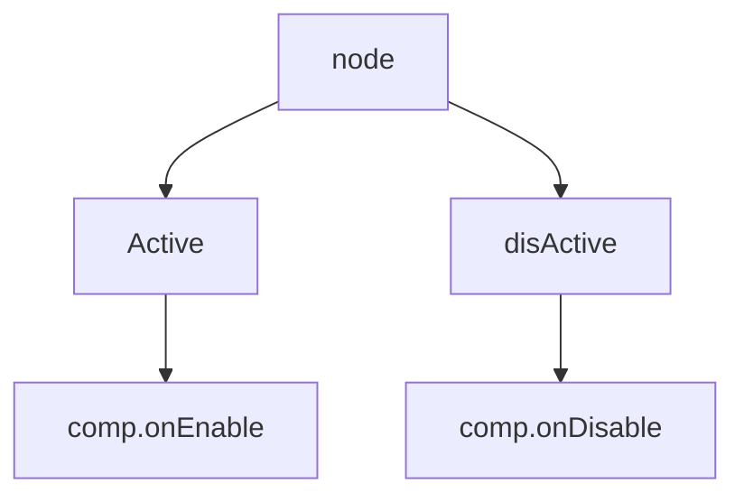

# NodeActivator and ComponentScheduler

## 前言
_本文基于 Cocos Creator 2.4.8 撰写_

## 正文
`ComponentScheduler` 集中调度（管理）游戏场景中所有组件（`cc.Component`）的生命周期的。除了生命周期中的 `onEnable` / `onDisable` 是和 `NodeActivator` 配合调度.

## `NodeActivator`
NodeActivator 类主要用于激活和反激活节点以及节点身上的组件。

```
_activateNodeRecursively (node, preloadInvoker, onLoadInvoker, onEnableInvoker) {
    // 判断标识
    if (node._objFlags & Deactivating) {
        // en:
        // Forbid reactive the same node during its deactivating procedure
        // to avoid endless loop and simplify the implementation.
        // zh:
        // 对相同节点而言，无法撤销反激活，防止反激活 - 激活 - 反激活的死循环发生。
        // 这样设计简化了一些引擎的实现，而且对调用者来说能保证反激活操作都能成功。
        cc.errorID(3816, node.name);
        return;
    }

    node._activeInHierarchy = true;

    // en:
    // component maybe added during onEnable, and the onEnable of new component is already called
    // so we should record the origin length
    // zh:
    // component 可能会在`onEnable`中添加新的`component`.所以我们必须记录原长度
    var originCount = node._components.length;
    // activate components
    for (let i = 0; i < originCount; ++i) {
        let component = node._components[i];
        if (component instanceof cc.Component) {
            this.activateComp(component, preloadInvoker, onLoadInvoker, onEnableInvoker);
        }
        else {
            _componentCorrupted(node, component, i);
            --i;
            --originCount;
        }
    }

    node._childArrivalOrder = node._children.length;
    
    // activate children recursively
    // 递归激活子节点
    for (let i = 0, len = node._children.length; i < len; ++i) {
        let child = node._children[i];
        child._localZOrder = (child._localZOrder & 0xffff0000) | (i + 1);
        if (child._active) {
            this._activateNodeRecursively(child, preloadInvoker, onLoadInvoker, onEnableInvoker);
        }
    }
    node._onPostActivated(true);
},

_deactivateNodeRecursively (node) {
    
    ...
    // 打上`Deactivating`标识
    node._objFlags |= Deactivating;
    // 反激活标识
    node._activeInHierarchy = false;

    // en:
    // component maybe added during onEnable, and the onEnable of new component is already called
    // so we should record the origin length
    // zh:
    // component 可能会在`onDisable`中添加新的`component`.所以我们必须记录原长度
    var originCount = node._components.length;
    for (let c = 0; c < originCount; ++c) {
        let component = node._components[c];
        if (component._enabled) {
            cc.director._compScheduler.disableComp(component);

            if (node._activeInHierarchy) {
                // reactivated from root
                node._objFlags &= ~Deactivating;
                return;
            }
        }
    }

    // 递归反激活节点
    for (let i = 0, len = node._children.length; i < len; ++i) {
        let child = node._children[i];
        if (child._activeInHierarchy) {
            this._deactivateNodeRecursively(child);

            if (node._activeInHierarchy) {
                // reactivated from root
                node._objFlags &= ~Deactivating;
                return;
            }
        }
    }

    // 停止节点上的所有 action
    node._onPostActivated(false);
    node._objFlags &= ~Deactivating;
},
```

## `ComponentScheduler`
负责在主循环中调度组件的`start`,`update`,`lateUpdate`.在`startPhase`中由`startInvoker`负责,`updatePhase`中由`updateInvoker`负责,`lateUpdatePhase`中由`lateUpdateInvoker`.然后在`startPhase`/`lateUpdatePhase`还会处理新激活节点`_startForNewComps`.<br/>
组件的`onEnable`/`onDisable`/`onDisable`,不通过主循环`mainLoop`,直接调用
- `LifeCycleInvoker`: 包含3个优先级排序队列:`_zero`/`_neg`/`_pos`,通过脚本调用.所有的调度都是继承该对象的
- `OneOffInvoker`: 继承`LifeCycleInvoker`,特性是一次性.
- `ReusableInvoker`: 继承`LifeCycleInvoker`, 特性是重复调用.

### properties
- startInvoker: `new OneOffInvoker(invokeStart)`.
- updateInvoker: `new ReusableInvoker(invokeUpdate)`.
- lateUpdateInvoker: `new ReusableInvoker(invokeLateUpdate)`.

### 方法
- sortedIndex (array, comp)
  - 内部
  - 使用`comp._id`进行排序
```
function sortedIndex (array, comp) {
    var order = comp.constructor._executionOrder;
    var id = comp._id;
    // 无符号右移
    for (var l = 0, h = array.length - 1, m = h >>> 1;
         l <= h;
         m = (l + h) >>> 1
    ) {
        var test = array[m];
        var testOrder = test.constructor._executionOrder;
        if (testOrder > order) {
            h = m - 1;
        }
        else if (testOrder < order) {
            l = m + 1;
        }
        else {
            var testId = test._id;
            if (testId > id) {
                h = m - 1;
            }
            else if (testId < id) {
                l = m + 1;
            }
            else {
                return m;
            }
        }
    }
    return ~l;
}
```

## 流程图
```mermaid
graph TD;
    addChild-->comp.onLoad-->comp.onEnable-->comp.start
    removeChild-->comp.onDisable
    addComponent-->comp.onLoad
    removeComponent--OnlyDisable-->comp.onDisable.->comp.onDestroy
```


