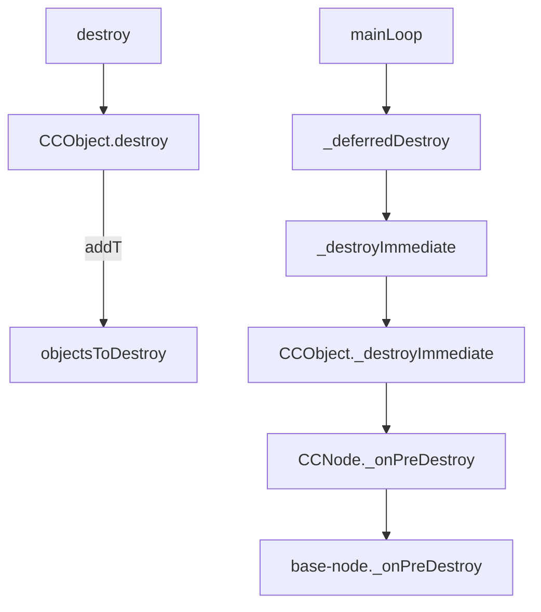

# Remove and Destroy

## 前言
_本文基于 Cocos Creator 2.4.8 撰写_

## 正文
`remove`只是把节点移出父节点的`_children`,并不会释放内存,所以可以重新`addChild`.
`destroy`将调用`CCObject`中的`destroy`将节点标识加上`ToDestroy`,放入`objectsToDestroy`组中.在下一次帧渲染前统一执行摧毁并释放内存

## 源码
当节点调用了`destroy`,会调用基类`CCObject`的`destroy`.并把`active`设置`false`
```
destroy () {
    if (cc.Object.prototype.destroy.call(this)) {
        this.active = false;
    }
},
```

销毁该对象，并释放所有它对其它对象的引用。实际销毁操作会延迟到当前帧渲染前执行。从下一帧开始，该对象将不再可用。您可以在访问对象之前使用 `cc.isValid(obj)` 来检查对象是否已被销毁。
```
prototype.destroy = function () {
    if (this._objFlags & Destroyed) {
        cc.warnID(5000);
        return false;
    }
    if (this._objFlags & ToDestroy) {
        return false;
    }
    // 添加标识
    this._objFlags |= ToDestroy;
    // 加入摧毁组
    objectsToDestroy.push(this);
    ...
    return true;
};
```
在帧渲染前进行`Destroy`
```
/*
* Run main loop of director
*/
mainLoop: function (now) {
    if (this._purgeDirectorInNextLoop) {
        this._purgeDirectorInNextLoop = false;
        this.purgeDirector();
    }
    else {
        // calculate "global" dt
        this.calculateDeltaTime(now);

        // Update
        if (!this._paused) {
            ...

            // Destroy entities that have been removed recently
            Obj._deferredDestroy();
        }

        // Render
        this.emit(cc.Director.EVENT_BEFORE_DRAW);
        renderer.render(this._scene, this._deltaTime);

        ...

        this._totalFrames++;
    }
},
```
位判断`_objFlags`是否有标识`Destroyed`,无则进入`_destroyImmediate`
```
function deferredDestroy () {
    var deleteCount = objectsToDestroy.length;
    for (var i = 0; i < deleteCount; ++i) {
        var obj = objectsToDestroy[i];
        if (!(obj._objFlags & Destroyed)) {
            obj._destroyImmediate();
        }
    }
    // if we called b.destory() in a.onDestroy(), objectsToDestroy will be resized,
    // but we only destroy the objects which called destory in this frame.
    if (deleteCount === objectsToDestroy.length) {
        objectsToDestroy.length = 0;
    }
    else {
        objectsToDestroy.splice(0, deleteCount);
    }

    if (CC_EDITOR) {
        deferredDestroyTimer = null;
    }
}
```
调用`_onPreDestroy`,并在`_objFlags`加上`Destroyed`标识
```
prototype._destroyImmediate = function () {
    if (this._objFlags & Destroyed) {
        cc.errorID(5000);
        return;
    }
    // engine internal callback
    if (this._onPreDestroy) {
        this._onPreDestroy();
    }

    ...

    this._objFlags |= Destroyed;
};
```
`CCNode`
- 调用`base-node._onPreDestroyBase`
- 删除所有Action
- 移除鼠标触摸目标
- 冒泡/捕获事件清理
- 触摸事件清理
- `_proxy`摧毁
- 返回对象池
- 取消`cc.Director.EVENT_AFTER_UPDATE`
```
_onPreDestroy () {
    // 调用 base-node 的 onPreDestroy
    var destroyByParent = this._onPreDestroyBase();

    // Actions
    if (ActionManagerExist) {
        cc.director.getActionManager().removeAllActionsFromTarget(this);
    }

    // Remove Node.currentHovered
    if (_currentHovered === this) {
        _currentHovered = null;
    }

    this._bubblingListeners && this._bubblingListeners.clear();
    this._capturingListeners && this._capturingListeners.clear();

    // Remove all event listeners if necessary
    if (this._touchListener || this._mouseListener) {
        eventManager.removeListeners(this);
        if (this._touchListener) {
            this._touchListener.owner = null;
            this._touchListener.mask = null;
            this._touchListener = null;
        }
        if (this._mouseListener) {
            this._mouseListener.owner = null;
            this._mouseListener.mask = null;
            this._mouseListener = null;
        }
    }

    if (CC_JSB && CC_NATIVERENDERER) {
        this._proxy.destroy();
        this._proxy = null;
    }

    this._backDataIntoPool();

    if (this._reorderChildDirty) {
        cc.director.__fastOff(cc.Director.EVENT_AFTER_UPDATE, this.sortAllChildren, this);
    }
    ...
},
```
`base-node`.
- 设置`Destroying`标识
- 摧毁子节点
- 摧毁自身组件
- 取消所有事件
- 持久化节点删除
- 从父节点删除
```
_onPreDestroy () {
    var i, len;

    // marked as destroying
    this._objFlags |= Destroying;

    // detach self and children from editor
    var parent = this._parent;
    var destroyByParent = parent && (parent._objFlags & Destroying);
    if (!destroyByParent && (CC_EDITOR || CC_TEST)) {
        this._registerIfAttached(false);
    }

    // destroy children
    var children = this._children;
    for (i = 0, len = children.length; i < len; ++i) {
        // destroy immediate so its _onPreDestroy can be called
        children[i]._destroyImmediate();
    }

    // destroy self components
    for (i = 0, len = this._components.length; i < len; ++i) {
        var component = this._components[i];
        // destroy immediate so its _onPreDestroy can be called
        component._destroyImmediate();
    }

    var eventTargets = this.__eventTargets;
    for (i = 0, len = eventTargets.length; i < len; ++i) {
        var target = eventTargets[i];
        target && target.targetOff(this);
    }
    eventTargets.length = 0;

    // remove from persist
    if (this._persistNode) {
        cc.game.removePersistRootNode(this);
    }

    if (!destroyByParent) {
        // remove from parent
        if (parent) {
            var childIndex = parent._children.indexOf(this);
            parent._children.splice(childIndex, 1);
            parent.emit && parent.emit('child-removed', this);
        }
    }

    return destroyByParent;
},
```

## 流程图
