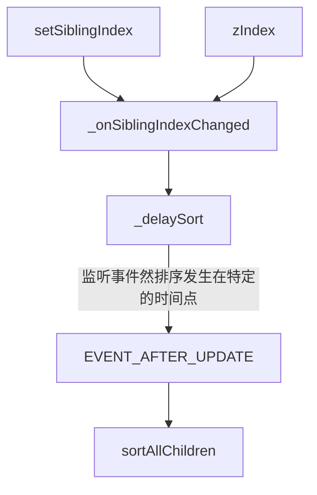

# zIndex and siblingIndex

## 前言
_本文基于 Cocos Creator 2.4.8 撰写_

## 正文
- `zIndex`:
  - 属于`CCNode`
  - getter: `_localZOrder >> 16`,将`_localZOrder`右移16位后返回.
  - setter: 左移`value`16位后与`_localZOrder`低16位组合,并触发`SIBLING_ORDER_CHANGED`事件.最后调用`_onSiblingIndexChanged`
- `siblingIndex`: 
  - 属于`base-node`
  - getter: 当前节点在父节点的 `_children` 属性中的下标（位置）
  - setter: 设置 `_children` 中的下标,最后调用`_onSiblingIndexChanged`
  
`zIndex`代表了`_localZOrder`高16位,`siblingIndex`代表了`_localZOrder`低16位

## 排序 (Sorting)
`siblingIndex` 和 `zIndex` 最后都调用了 `_onSiblingIndexChanged` 函数

```
_onSiblingIndexChanged () {
    // update rendering scene graph, sort them by arrivalOrder
    if (this._parent) {
        this._parent._delaySort();
    }
},
```

```
_delaySort () {
    if (!this._reorderChildDirty) {
        // 设置排序脏标识
        this._reorderChildDirty = true;
        cc.director.__fastOn(cc.Director.EVENT_AFTER_UPDATE, this.sortAllChildren, this);
    }
},
```
此处监听了事件`cc.Director.EVENT_AFTER_UPDATE`,触发节点在`_compScheduler.lateUpdatePhase`.在全部的逻辑帧结束后进行触发,让排序发生在特定的时间点
```
/**
 * !#en Sorts the children array depends on children's zIndex and arrivalOrder,
 * normally you won't need to invoke this function.
 * !#zh 根据子节点的 zIndex 和 arrivalOrder 进行排序，正常情况下开发者不需要手动调用这个函数。
 *
 * @method sortAllChildren
 */
sortAllChildren () {
    if (this._reorderChildDirty) {

        this._reorderChildDirty = false;

        // 计算`_localZOrder`的低16位
        // delay update arrivalOrder before sort children
        var _children = this._children, child;
        // reset arrivalOrder before sort children
        this._childArrivalOrder = 1;
        for (let i = 0, len = _children.length; i < len; i++) {
            child = _children[i];
            child._updateOrderOfArrival();
        }
        ...
        // 使用插入排序,排序子节点
        if (_children.length > 1) {
            // insertion sort
            let child, child2;
            for (let i = 1, count = _children.length; i < count; i++) {
                child = _children[i];
                let j = i;
                for (; j > 0 &&
                        (child2 = _children[j - 1])._localZOrder > child._localZOrder; j--) {
                    _children[j] = child2;
                }
                _children[j] = child;
            }

            this.emit(EventType.CHILD_REORDER, this);
        }
        cc.director.__fastOff(cc.Director.EVENT_AFTER_UPDATE, this.sortAllChildren, this);
    }
},
_updateOrderOfArrival () {
    var arrivalOrder = this._parent ? ++this._parent._childArrivalOrder : 0;
    this._localZOrder = (this._localZOrder & 0xffff0000) | arrivalOrder;

    this.emit(EventType.SIBLING_ORDER_CHANGED);
},
```

## 总结
在代码中修改节点顺序的方法主要有两种：

1. 修改节点的 `zIndex` 属性
2. 通过 `setSiblingIndex` 函数设置
3. `zIndex`的优先级大于`setSiblingIndex`
4. 相当于在同级`zIndex`下,会进行`setSiblingIndex`子排序

## 流程图

