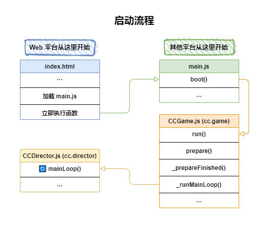
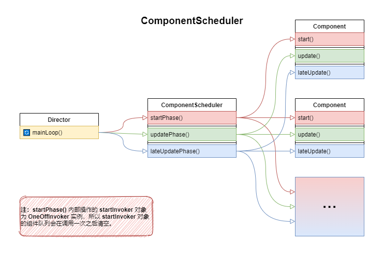
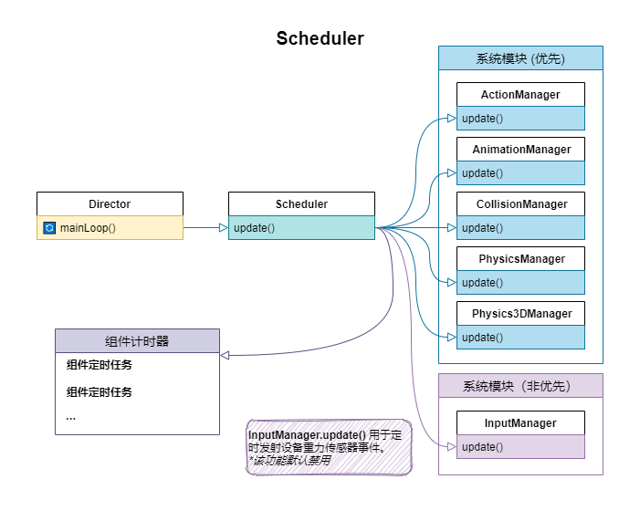
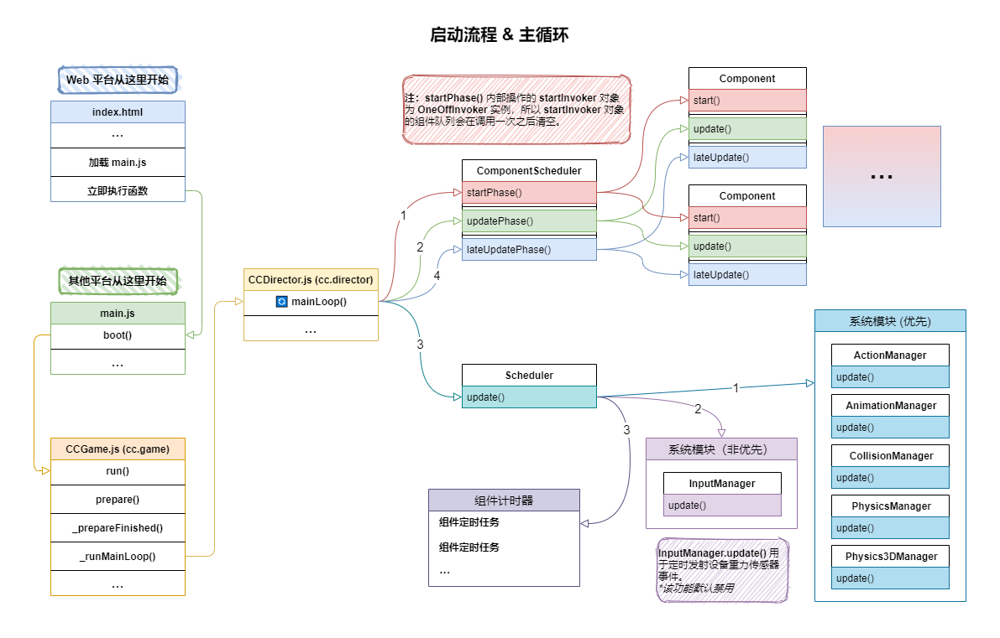

# 启动流程
[陈皮皮](https://chenpipi.cn/post/cocos-creator-source-launch-and-main-loop/)

## 前言
_本文基于 Cocos Creator 2.4.8 撰写。_

## index.html
对于 Web 平台来说 `index.html` 文件就是程序的起点。

在默认的 `index.html` 文件中，定义了游戏启动页面的布局，加载了 `main.js` 文件，并且还有一段立即执行的代码。

这里截取 `main.js` 文件中一部分比较关键的代码：

```
// 加载引擎脚本
loadScript(debug ? 'cocos2d-js.js' : 'cocos2d-js-min.js', function () {
  // 是否开启了物理系统？
  if (CC_PHYSICS_BUILTIN || CC_PHYSICS_CANNON) {
    // 加载物理系统脚本并启动引擎
    loadScript(debug ? 'physics.js' : 'physics-min.js', window.boot);
  } else {
    // 启动引擎
    window.boot();
  }
});
```
上面这段代码主要用于加载引擎脚本和物理系统脚本，脚本加载完成之后就会调用 `main.js` 中定义的 `window.boot` 函数。
>原生平台<br/>
对于原生平台，会在 `{项目目录}build\jsb-link\frameworks\runtime-src\Classes\AppDelegate.cpp` 文件的 `applicationDidFinishLaunching` 函数中加载 `main.js` 文件。
>
>——来自渡鸦大佬的补充
代码压缩<br/>
脚本文件名中带有 `-min` 字样（如 `index.min.js`）一般代表着这个文件内的代码是被压缩过的。
>
>压缩代码可以节省代码文件所占用的空间，加快文件加载速度，减少流量消耗，但同时也让代码失去了可阅读性，不利于调试。
所以开启调试模式后会直接使用未经过压缩的代码文件，便于开发调试和定位错误。

## main.js

### boot
>对于不同平台 `main.js` 的内容也有些许差异，这里我们忽略差异部分，只关注其中关键的共同行为。
关于 `main.js` 文件的内容基本上就是定义了 `window.boot` 函数。

对于非 Web 平台，会在定义完之后直接就调用 `window.boot` 函数，所以 `main.js` 就是他们的起点。

而 `window.boot` 函数内部有以下关键行为：

1. 定义 `onStart` 函数：主要用于加载启动场景
2. `cc.assetManager.init(...)`：初始化 AssetManager
3. `cc.assetManager.loadScript(...)`：加载 src 目录下的插件脚本
4. `cc.assetManager.loadBundle(...)`：加载项目中的 bundle
5. `cc.game.run(...)`：启动引擎
   
这部分的代码就不贴了，小伙伴们可以看看自己的项目构建后的 `main.js` 文件。

## cc.game

[源码](https://github.com/cocos/cocos-engine/blob/2.4.8/cocos2d/core/CCGame.js)

`cc.game` 对象是 `cc.Game` 类的一个实例，`cc.game` 包含了游戏主体信息并负责驱动游戏。

说人话，`cc.game` 对象就是管理引擎生命周期的模块，启动、暂停和重启等操作都需要用到它。

### run

`cc.game.run` 函数内指定了引擎配置和 `onStart` 回调并触发 `cc.game.prepare()` 函数。

源码节选：

函数：[cc.game.run](https://github.com/cocos/cocos-engine/blob/2.4.8/cocos2d/core/CCGame.js#L491)
```
run: function (config, onStart) {
  // 指定引擎配置
  this._initConfig(config);
  this.onStart = onStart;
  this.prepare(game.onStart && game.onStart.bind(game));
}
```

### prepare
`cc.game.prepare` 函数内主要在项目预览时快速编译项目代码并调用 `_prepareFinished` 函数。

源码节选：

函数：[cc.game.prepare](https://github.com/cocos-creator/engine/blob/2.4.8/cocos2d/core/CCGame.js#L472)

```
prepare(cb) {
  // 已经准备过则跳过
  if (this._prepared) {
    if (cb) cb();
    return;
  }
  // 加载预览项目代码
  this._loadPreviewScript(() => {
    this._prepareFinished(cb);
  });
}
```

>快速编译<br/>
对于快速编译的细节，可以在项目预览时打开浏览器的开发者工具，在 Sources 栏中搜索（Ctrl + P） `__quick_compile_project__` 即可找到 `__quick_compile_project__.js` 文件。

### _prepareFinished
`cc.game._prepareFinished()` 函数的作用主要为初始化引擎、设置帧率计时器和初始化内建资源（`effect` 资源和 `material` 资源）。

当内建资源加载完成后就会调用 `cc.game._runMainLoop()` 启动引擎主循环。

源码节选：

函数：[cc.game._prepareFinished](https://github.com/cocos-creator/engine/blob/2.4.8/cocos2d/core/CCGame.js#L387)

```
_prepareFinished(cb) {
  // 初始化引擎
  this._initEngine();
  // 设置帧率计时器
  this._setAnimFrame();
  // 初始化内建资源（加载内置的 effect 和 material 资源）
  cc.assetManager.builtins.init(() => {
    // 打印引擎版本到控制台
    console.log('Cocos Creator v' + cc.ENGINE_VERSION);
    this._prepared = true;
    // 启动 mainLoop
    this._runMainLoop();
    // 发射 ‘game_inited’ 事件（代表引擎已初始化完成）
    this.emit(this.EVENT_GAME_INITED);
    // 调用 main.js 中定义的 onStart 函数
    if (cb) cb();
  });
}
```

### _setAnimFrame

函数: [cc.game._setAnimFrame](https://github.com/cocos-creator/engine/blob/2.4.8/cocos2d/core/CCGame.js#L564)

对于 `_prepareFinished` 函数内调用的 `_setAnimFrame` 函数这里必须提一下。

 函数内部对不同的游戏帧率做了适配。

另外还对 `window.requestAnimationFrame` 函数做了兼容性封装，用于兼容不同的浏览器环境，具体的我们下面再说。

这里就不贴 `_setAnimFrame` 函数的代码了，有需要的小伙伴可自行查阅。

### _runMainLoop
`cc.game._runMainLoop` 函数的名字取得很简单直接，摊牌了它就是用来运行 `mainLoop` 函数的。

源码节选：

函数：[cc.game._runMainLoop](https://github.com/cocos-creator/engine/blob/2.4.8/cocos2d/core/CCGame.js#L612)
```
_runMainLoop: function () {
  if (CC_EDITOR) return;
  if (!this._prepared) return;
  // 定义局部变量
  var self = this, callback, config = self.config,
    director = cc.director,
    skip = true, frameRate = config.frameRate;
  // 展示或隐藏性能统计
  debug.setDisplayStats(config.showFPS);
  // 设置帧回调
  callback = function (now) {
    if (!self._paused) {
      // 循环调用回调
      self._intervalId = window.requestAnimFrame(callback);
      if (!CC_JSB && !CC_RUNTIME && frameRate === 30) {
          if (skip = !skip) return;
      }
      // 调用 mainLoop
      director.mainLoop(now);
    }
  };
  // 将在下一帧开始循环回调
  self._intervalId = window.requestAnimFrame(callback);
  self._paused = false;
}
```

通过以上代码我们可以得知，`_runMainLoop` 函数主要通过 `window.requestAnimFrame` 函数来实现循环调用 `mainLoop` 函数。

### requestAnimFrame
`window.requestAnimFrame` 函数就是我们上面说到的 `_setAnimFrame` 函数内部对于 `window.requestAnimationFrame` 函数的兼容性封装。

对前端不太熟悉的小伙伴可能会有疑问，`window.requestAnimationFrame` 又是啥，是用来干嘛的，又是如何运行的？

### requestAnimationFrame
简单来说，`window.requestAnimationFrame` 函数用于向浏览器请求进行一次重绘（repaint），并在重绘之前调用指定的回调函数。

`window.requestAnimationFrame` 函数接收一个回调作为参数并返回一个整数作为唯一标识，浏览器将会在下一个重绘之前执行这个回调；并且执行回调时会传入一个参数，参数的值与 `performance.now()` 返回的值相等。

>Performance.now()<br/>
performance.now() 的返回值可以简单理解为浏览器窗口的运行时长，即从打开窗口到当前时刻的时间差。

[MDN] [Performance.now()](https://developer.mozilla.org/zh-CN/docs/Web/API/Performance/now): 
回调函数的执行次数通常与浏览器屏幕刷新次数相匹配，也就是说，对于刷新率为 60Hz 的显示器，浏览器会在一秒内执行 60 次回调函数。

对于 `window.requestAnimationFrame` 函数的说明到此为止，如果想要了解更多信息请自行检索。

[MDN] [window.requestAnimationFrame](https://developer.mozilla.org/zh-CN/docs/Web/API/Window/requestAnimationFrame)

## 小结
画一张图来对引擎的启动流程做一个小小的总结叭~



## 主循环

### cc.director
[源码](https://github.com/cocos-creator/engine/blob/2.4.8/cocos2d/core/CCDirector.js)

`cc.director` 对象是导演类 `cc.Director` 的实例，引擎通主要过 `cc.director` 对象来管理游戏的逻辑流程。

### mainLoop
`cc.director.mainLoop` 函数可能是引擎中最关键的逻辑之一了，包含的内容很多也很关键。

现在让我们进入 `mainLoop` 函数内部来一探究竟吧！

[cc.Director.prototype.mainLoop](https://github.com/cocos-creator/engine/blob/2.4.8/cocos2d/core/CCDirector.js#L843):
```
mainLoop: function (now) {
    // 计算“全局”增量时间（DeltaTime）
    // 也就是距离上一次调用 mainLoop 的时间间隔
    this.calculateDeltaTime(now);
    // 游戏没有暂停则进行更新
    if (!this._paused) {
        // 发射 'director_before_update' 事件
        this.emit(cc.Director.EVENT_BEFORE_UPDATE);
        // 调用新增的组件（已启用）的 start 函数
        this._compScheduler.startPhase();
        // 调用所有组件（已启用）的 update 函数
        this._compScheduler.updatePhase(this._deltaTime);
        // 更新调度器（cc.Scheduler）
        this._scheduler.update(this._deltaTime);
        // 调用所有组件（已启用）的 lateUpdate 函数
        this._compScheduler.lateUpdatePhase(this._deltaTime);
        // 发射 'director_after_update' 事件
        this.emit(cc.Director.EVENT_AFTER_UPDATE);
        // 销毁最近被移除的实体（节点）
        Obj._deferredDestroy();
    }
    // 发射 'director_before_draw' 事件
    this.emit(cc.Director.EVENT_BEFORE_DRAW);
    // 渲染游戏场景
    renderer.render(this._scene, this._deltaTime);
    // 发射 'director_after_draw' 事件
    this.emit(cc.Director.EVENT_AFTER_DRAW);
    // 更新事件管理器的事件监听（cc.eventManager 已被废弃）
    eventManager.frameUpdateListeners();
    // 累加游戏运行的总帧数
    this._totalFrames++;
}
``` 

🔬 接下来我们来对主循环中的关键点一一进行分解。

[ComponentScheduler](https://github.com/cocos-creator/engine/blob/2.4.8/cocos2d/core/component-scheduler.js)

`cc.director` 对象中的 `_compScheduler属性` 是 `ComponentScheduler` 类的实例。

大多数小伙伴可能对于 `ComponentScheduler` 这个类没有什么印象，我来简单解释一下。

将 `ComponentScheduler` 的名字直译过来就是“组件调度器”，从名字上就可以看出，这个类是用来调度组件的。

说人话，**ComponentScheduler 类是用来集中调度（管理）游戏场景中所有组件（cc.Component）的生命周期的。**

🎨 文字不够直观，看完下面这张图大概就懂了：


### startPhase
📝 `mainLoop` 函数代码片段：

// 调用上一帧新增（且已启用）的组件的 `start` 函数
`this._compScheduler.startPhase()`;
组件的 `start` 回调函数会在组件第一次激活前，也就是第一次执行 `update` 之前触发。

在组件的一生中 `start` 回调只会被触发一次。

而 `start` 则会等到下一次主循环 `mainLoop()` 时才触发。

💡 知识补充

生命周期中的 `onLoad` 和 `onEnable` 是由 [NodeActivator](./NodeActivator.md) 类的来管理的：

`onLoad` 在节点首次激活时触发
`onEnable` 在组件每次被启用时都会触发
🎛 NodeActivator

`NodeActivator` 类主要用于激活和反激活节点以及节点身上的组件。

`cc.director` 对象中就拥有一个实例 `_nodeActivator`。如激活节点时会调用 `cc.director._nodeActivator.activateNode(this, value);`。

[node-activator.js](https://github.com/cocos-creator/engine/blob/2.4.8/cocos2d/core/node-activator.js)

### updatePhase
📝 `mainLoop` 函数代码片段：

// 调用所有（已启用）组件的 `update` 函数
`this._compScheduler.updatePhase(deltaTime);`
组件的 `update` 回调每一帧都会被触发一次。

### lateUpdatePhase
📝 `mainLoop` 函数代码片段：

// 调用所有组件（已启用）的 `lateUpdate` 函数
`this._compScheduler.lateUpdatePhase(deltaTime);`
组件的 `lateUpdate` 回调会在「组件 `update` 回调执行后、调度器（`cc.Scheduler`）更新后」被触发。

调度器（`cc.Scheduler`）的更新内容包括缓动、动画和物理等，这一点下面会展开。

### ParticleSystem
BTW，粒子系统组件（`cc.ParticleSystem`）就是在 `lateUpdate` 回调函数中进行更新的。

[CCParticleSystem.js#L923](https://github.com/cocos-creator/engine/blob/2.4.8/cocos2d/particle/CCParticleSystem.js#L923)

## Scheduler
`cc.director` 对象的 `_scheduler` 属性是 `cc.Scheduler` 类的一个实例。

`cc.Scheduler` 是负责触发回调函数的类。

[Scheduler.js](https://github.com/cocos-creator/engine/blob/2.4.8/cocos2d/core/Scheduler.js)

📝 `mainLoop` 函数代码片段：

你绝对猜不到下面这一行看起来如此平平无奇的代码执行之后会发生什么。

// 更新调度器（`cc.Scheduler` 类实例）
`this._scheduler.update(this._deltaTime);`
`cc.director.mainLoop` 函数中使用调度器 `_scheduler` 的 `update` 函数来分发 `update`，在调度器内部会根据优先级先后触发各个系统模块和组件计时器的更新。

### 系统模块
调度器的更新会先触发以下系统模块的更新：

* `ActionManager`
* `AnimationManager`
* `CollisionManager`
* `PhysicsManager`
* `Physics3DManager`
* `InputManager`
  
以上这些模块都以 `cc.director._scheduler.scheduleUpdate()` 的方式注册到调度器上，因为这些模块每一帧都需要进行更新。

除了 `InputManager` 以外的模块的优先级都为 `cc.Scheduler.PRIORITY_SYSTEM`，也就是「系统优先级」，会优先被触发。

### ActionManager
`ActionManager` 即动作管理器，用于管理游戏中的所有动作，也就是缓动系统 `Action` 和 `Tween`（其实它们本质上是同一种东西）。

[源码](https://github.com/cocos-creator/engine/blob/2.4.8/cocos2d/actions/CCActionManager.js)

### AnimationManager
`AnimationManager` 即动画管理器，用于管理游戏中的所有动画，驱动节点上的 `Animation` 组件播放动画。

[源码](https://github.com/cocos-creator/engine/blob/2.4.8/cocos2d/animation/animation-manager.js)

### CollisionManager
`CollisionManager` 即碰撞组件管理器，用于处理节点之间的碰撞组件是否产生了碰撞，并调用相应回调函数。

[源码](https://github.com/cocos-creator/engine/blob/2.4.8/cocos2d/collider/CCCollisionManager.js)

### PhysicsManager
`PhysicsManager` 即物理系统管理器，内部以 Box2D 作为 2D 物理引擎，加以封装并开放部分常用的接口。同时 `PhysicsManager` 还负责管理碰撞信息的分发。

[源码](https://github.com/cocos-creator/engine/blob/2.4.8/cocos2d/core/physics/CCPhysicsManager.js)

### Physics3DManager
`Physics3DManager` 即3D 物理系统管理器，`Cocos Creator` 中的 `3D` 物理引擎有 `Cannon.js` 和 `Builtin` 可选，`Physics3DManager` 给它们封装了统一的常用接口。

[源码](https://github.com/cocos-creator/engine/blob/2.4.8/cocos2d/core/3d/physics/framework/physics-manager.ts)

### InputManager
`InputManager` 即输入事件管理器，用于管理所有输入事件。开发者主动启用加速度计（`Accelerometer`）之后，引擎会定时通过 `InputManager` 发送 `cc.SystemEvent.EventType.DEVICEMOTION` 事件（默认间隔为 0.2 秒）。

[源码](https://github.com/cocos-creator/engine/blob/2.4.8/cocos2d\core\platform\CCInputManager.js)

### 组件计时器
相信大多数小伙伴都使用过组件的 `schedule` 和 `scheduleOnce` 函数，主要用来延迟或重复执行指定的函数。

实际上，`cc.Component` 的 `schedule` 函数依赖的也是 `cc.Scheduler` 类，具体使用的也是 `cc.director` 对象中的 `_scheduler` 实例。

组件的 `schedule` 函数在 `cc.director._scheduler.schedule` 函数之外加了一层封装，「以组件自身作为 `target`，这样一来组件内的定时任务就与组件生命周期绑定，当组件被销毁时定时任务也会被移除。」

而 `scheduleOnce` 函数则是在组件的 `schedule` 接口之外又加了一层简单的封装，写死只会在指定时间后执行一次。

[源码 CCComponent.js#L555](https://github.com/cocos-creator/engine/blob/2.4.8/cocos2d/core/components/CCComponent.js#L555)

[文档 使用计时器](http://docs.cocos.com/creator/manual/zh/scripting/scheduler.html)

### setTimeout & setInterval
另外我还注意到，有不少小伙伴还不是很清楚组件的计时器和 `setTimeout`、`setInterval` 之间的区别和用法，那就趁这个机会简单讲一下吧~

`首先，setTimeout` 和 `setInterval` 函数都是由浏览器或 `Node.js` 这类 `runtime` 所提供的接口。

`setTimeout` 函数用于设置一个定时器，该定时器在定时器到期后执行一个函数或指定的一段代码。
`setInterval` 函数用于重复调用一个函数或执行一个代码段，在每次调用之间具有固定的时间延迟。
知识补充
在浏览器中 `setTimeout` 和 `setInterval` 函数的最小延时（间隔）是 4ms。

如果是未激活（处于后台）的标签页（tab），最小延时（间隔）则加长到 1000ms。

🌰 举个栗子

假如我在当前标签页设置了一个每 500ms 输出一个 log 的定时器，当我切换到别的标签页之后，那么这个定时器就会变成每 1000ms 才输出一个 log。

📝 像这样（可以自己跑跑看）：
```
setInterval(() => {
  console.log(Date.now());
}, 500);
// 模拟输出
// 标签页在前台
// 1604373521000
// 1604373521500
// 1604373522000
// 切换到别的标签页后
// 1604373523000
// 1604373524000
// 1604373525000
```

区别 & 用法
组件的计时器依赖于引擎的 `mainLoop()` 和组件自身，如果引擎被暂停，那么组件的计时器也会被暂停，如果组件或组件所在的节点被销毁了，那么计时器也会失效。

`setTimeout()` 和 `setInterval()` 都依赖于当前所处的 `window` 对象，也就是说只要当前浏览器标签页不关闭，`setTimeout()` 和 `setInterval()` 都还是会执行的。

当你需要在组件内部定时或重复执行某一函数或操作某个节点，那么可以使用组件的计时器。

💬 让我们想象一个场景：

在当前场景中的某个脚本内使用 `setInterval()` 来重复移动场景中的某个节点，当我们切换场景后会发生什么？

当定时器再次调用回调尝试移动节点的时候，会无法找到目标节点而报错，因为节点已经跟着之前的场景一起被销毁了，而定时器还在继续执行。

这种情况下使用组件的计时器就不会有这种问题，因为计时器会随着组件的销毁而被清除。

而当我们需要执行一些与游戏场景没有关联的事情的时候，就可以考虑使用 `setTimeout()` 或 `setInterval()`。

🎃 当然能用组件计时器的话最好还是用组件计时器啦~

小结
🎨 同样也画一张图来小小总结一下 Scheduler。


总结
🎉 关于引擎的启动流程和主循环就解读到这里啦。

如果有遗漏或错误的地方，也欢迎大家提出来，毕竟熬夜写文章精神恍惚漏了也是情有可原的对吧哈哈哈~

🎨 最后的最后，再画一张图来做一个最后的总结~

