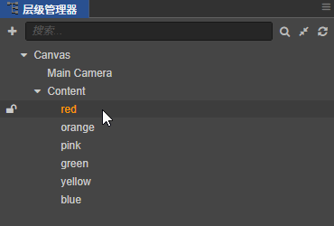

# Cocos Creator 源码解读：siblingIndex 与 zIndex
[陈皮皮](https://chenpipi.cn/post/cocos-creator-node-order/)

## 前言
_本文基于 Cocos Creator 2.4.8 撰写。_

## 节点顺序 (Node Order)
🤔 如何修改节点的顺序？

首先，在 Cocos Creator 编辑器中的「层级管理器」中，我们可以随意拖动节点来改变节点的顺序。


🤨 但是，在代码中我们要怎么做呢？

我最先想到的是节点的 `setSiblingIndex` 函数，然后是节点的 `zIndex` 属性。

我猜大多数人都不清楚这两个方案有什么区别。

**那么接下来就让我们深入源码，一探究竟！**

## siblingIndex
「`siblingIndex`」即「同级索引」，意为「同一父节点下的兄弟节点间的位置」。

`siblingIndex` 越小的节点排越前，索引最小值为 0，也就是第一个节点的索引值。

需要注意的是，实际上节点并没有 `siblingIndex` 属性，只有 `getSiblingIndex` 和 `setSiblingIndex` 这两个相关函数。

注：本文统一使用 siblingIndex 来代指 `getSiblingIndex` 和 `setSiblingIndex` 函数。

另外，`getSiblingIndex` 和 `setSiblingIndex` 函数是由 `cc._BaseNode` 实现的。

💡 cc._BaseNode

大家对这个类可能会比较陌生，简单来说 `cc._BaseNode` 是 `cc.Node` 的基类。

此类「定义了节点的基础属性和函数」，包括但不仅限于 `setParent`、`addChild` 和 `getComponent` 等常用函数…

📝 源码节选：

函数：_`cc._BaseNode.prototype.getSiblingIndex`_
```
getSiblingIndex () {
    if (this._parent) {
        return this._parent._children.indexOf(this);
    }
    else {
        return 0;
    }
},
```
函数：_`cc._BaseNode.prototype.setSiblingIndex`_
```
setSiblingIndex (index) {
    if (!this._parent) {
        return;
    }
    if (this._parent._objFlags & Deactivating) {
        cc.errorID(3821);
        return;
    }
    var siblings = this._parent._children;
    index = index !== -1 ? index : siblings.length - 1;
    var oldIndex = siblings.indexOf(this);
    if (index !== oldIndex) {
        siblings.splice(oldIndex, 1);
        if (index < siblings.length) {
            siblings.splice(index, 0, this);
        }
        else {
            siblings.push(this);
        }
        this._onSiblingIndexChanged && this._onSiblingIndexChanged(index);
    }
},
```
[源码] [base-node.js#L514](https://github.com/cocos-creator/engine/blob/2.4.8/cocos2d/core/utils/base-node.js#L514)

### 🕵️‍ 做了什么？

扒拉源码后发现，`siblingIndex` 的本质其实很简单。

那就是「当前节点在父节点的 `_children` 属性中的下标（位置）」。

`getSiblingIndex` 函数返回的是「当前节点在父节点的 `_children` 属性中的下标（位置）」。

`setSiblingIndex` 函数则是设置「当前节点在父节点的 `_children` 属性中的下标（位置）」。

>💡 `cc._BaseNode.prototype._children`
>
>节点的 `_children` 属性其实就是节点的 `children` 属性。
>
>而 `children` 属性是一个 `getter`，返回的是自身的 `_children` 属性。
>
>另外 `children` 属性没有实现 `setter`，所以你直接给 `children` 属性赋值是无效的。

### zIndex
`「zIndex」`是「用来对节点进行排序的关键属性」，它决定了一个节点在兄弟节点之间的位置。

`zIndex` 的值介于 `cc.macro.MIN_ZINDEX` 和 `cc.macro.MAX_ZINDEX` 之间。

另外，`zIndex` 属性是在 `cc.Node` 内使用 `Cocos` 定制版 `getter` 和 `setter` 实现的。

📝 源码节选：

属性: `cc.Node.prototype.zIndex`
```        
zIndex: {
    get () {
        return this._localZOrder >> 16;
    },
    set (value) {
        if (value > macro.MAX_ZINDEX) {
            cc.warnID(1636);
            value = macro.MAX_ZINDEX;
        }
        else if (value < macro.MIN_ZINDEX) {
            cc.warnID(1637);
            value = macro.MIN_ZINDEX;
        }

        if (this.zIndex !== value) {
            this._localZOrder = (this._localZOrder & 0x0000ffff) | (value << 16);
            this.emit(EventType.SIBLING_ORDER_CHANGED);

            this._onSiblingIndexChanged();
        }
    }
},
```

[源码] [CCNode.js#L1549](https://github.com/cocos-creator/engine/blob/2.4.5/cocos2d/core/CCNode.js#L1549)

🕵️ 做了什么？

扒拉源码后发现，`zIndex` 的本质其实也很简单。

那就是「返回或设置节点的 `_localZOrder` 属性」。

🧐 没那么简单！

有趣的是，在 `getter` 中并没有直接返回 `_localZOrder` 属性，而是返回了 `_localZOrder` 属性右移（>>）16 位后的数值。

在 `setter` 中设置 `_localZOrder` 属性时也并非简单的赋值，又是进行了一顿位操作：

这里我们以二进制数的视角来分解该函数内的位操作。
1. 通过 & 0x0000ffff 取出原 _localZOrder 的「低 16 位」；
2. 将目标值 value「左移 16 位」；
3. 将左移后的 value 作为「高 16 位」与原 _localZOrder 的「低 16 位」合并；
4. 最后得到一个「32 位的二进制数」并赋予 _localZOrder。

>😲 嗯？
>
>慢着！_localZOrder 又是干啥用的？咋这么绕！
>
>别急，答案在后面~

## 排序 (Sorting)
细心的朋友应该发现了，`siblingIndex` 和 `zIndex` 的源码中都没有包含实际的排序逻辑。

但是它们都有一个共同点：「最后都调用了自身的 `_onSiblingIndexChanged` 函数」。

## _onSiblingIndexChanged
📝 源码节选：

函数：`cc.Node.prototype._onSiblingIndexChanged`
```
_onSiblingIndexChanged() {
  if (this._parent) {
    this._parent._delaySort();
  }
},
```
🕵️ 做了什么？

而 `_onSiblingIndexChanged` 函数内则是调用了「父节点」的 `_delaySort` 函数。

## _delaySort
📝 源码节选：

函数：`cc.Node.prototype._delaySort`
```
_delaySort() {
  if (!this._reorderChildDirty) {
    this._reorderChildDirty = true;
    cc.director.__fastOn(cc.Director.EVENT_AFTER_UPDATE, this.sortAllChildren, this);
  }
},
```
🕵️ 做了什么？

一顿操作顺藤摸瓜后发现，真正进行排序的地方是「父节点」的 `sortAllChildren` 函数。

>💡 盲生，你发现了华点！
>
>值得注意的是，`_delaySort` 函数中的 `sortAllChildren` 函数调用不是立即触发的，而是会在下一次 `update`（生命周期）后触发。
>
>延迟触发的目的应该是为了避免在同一帧内的重复调用，从而减少不必要的性能损耗。

## sortAllChildren
源码节选：

函数：`cc.Node.prototype.sortAllChildren`
```
// 为了减少篇幅，已省略部分不相关代码
sortAllChildren() {
  if (this._reorderChildDirty) {
    this._reorderChildDirty = false;
    // Part 1
    var _children = this._children, child;
    this._childArrivalOrder = 1;
    for (let i = 0, len = _children.length; i < len; i++) {
      child = _children[i];
      child._updateOrderOfArrival();
    }
    eventManager._setDirtyForNode(this);
    // Part 2
    if (_children.length > 1) {
      let child, child2;
      for (let i = 1, count = _children.length; i < count; i++) {
        child = _children[i];
        let j = i;
        for (;
          j > 0 && (child2 = _children[j - 1])._localZOrder > child._localZOrder;
          j--
        ) {
          _children[j] = child2;
        }
        _children[j] = child;
      }
      this.emit(EventType.CHILD_REORDER, this);
    }
    cc.director.__fastOff(cc.Director.EVENT_AFTER_UPDATE, this.sortAllChildren, this);
  }
},
```
[源码] [CCNode.js#L3680](https://github.com/cocos-creator/engine/blob/2.4.8/cocos2d/core/CCNode.js#L3680)

## 上半部分 (Part 1)
随着一步步深入，我们终于来到了关键部分。

现在让我们琢磨琢磨这个 `sortAllChildren` 函数。

进入该函数的前半段，映入眼帘的是一行赋值语句，将 `_childArrivalOrder` 属性设（重置）为 `1`；

紧跟其后的是一个 for 循环，遍历了当前节点的所有「子节点」，并一一执行「子节点」的 `_updateOrderOfArrival` 函数。

🤨 嗯？这个 `_updateOrderOfArrival` 函数又是何方神圣？

## _updateOrderOfArrival
📝 源码节选：

函数：`cc.Node.prototype._updateOrderOfArrival`
```
_updateOrderOfArrival() {
  var arrivalOrder = this._parent ? ++this._parent._childArrivalOrder : 0;
  this._localZOrder = (this._localZOrder & 0xffff0000) | arrivalOrder;
  this.emit(EventType.SIBLING_ORDER_CHANGED);
},
```